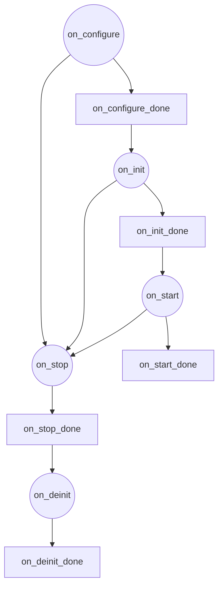

# Page 6

```mermaid
graph TD;
  on_configure((on_configure));
  on_init((on_init));
  on_start((on_start));
  on_stop((on_stop));
  on_deinit((on_deinit));

  on_configure-->on_configure_done
  on_configure_done-->on_init;
  on_configure-->on_stop;
  on_init-->on_init_done;
  on_init_done-->on_start;
  on_init-->on_stop;
  on_start-->on_stop;
  on_start-->on_start_done;
  on_stop-->on_stop_done;
  on_stop_done-->on_deinit;
  on_deinit-->on_deinit_done;
```

